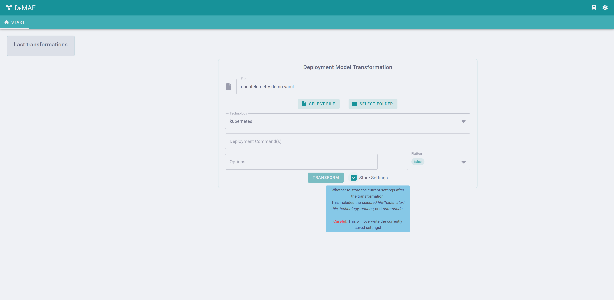

# DeMAF WebUI Usage

## Introduction to DeMAF

The *Deployment Model Abstraction Framework* (DeMAF) is a tool that enables the transformation of a *technology-specific deployment model* (TSDM) into a *technology-agnostic deployment model* (TADM) which is modeled based on the *Essential Deployment Metamodel* (EDMM).
Additionally, it has a built-in visualization tool for the created TADM.
DeMAF is still in development, some features may not work as intended and the behavior might change

## Getting Started

### Summary

To transform a TSDM, its corresponding file(s) must be *uploaded*, and its deployment *technology* must be specified.
A *flattening option* can be set as well.
Optionally, additional *options* relating the visualizations and the *command* which is used to start the deployment (i.e. a bash script) can be provided too.
The transformation is started by clicking on the *"Transform"* button and a spinning gear icon indicates that the transformation is in progress.
This may take some time on the first start, as the plugins have to prepare for the initial transformation.
After a successful transformation, a new tab is opened with the loading visualization tool.
This may take some time as well, depending on the amount of prior transformations.

The web UI supports multiple tooltips which can help you get started as well.

### Step 1: Uploading

The DeMAF web interface provides two options for uploading TSDM files.
You can either choose to upload a single file or a folder that includes all multiple files (for the same TSDM).

#### Uploading a single file

1. Click on *"Select File"* and your system's file explorer pops up.
2. Select your file and click on *"Open"*.
3. Now your file is uploaded!
   A new text field will appear that shows your uploaded file name.

#### Uploading a folder with multiple files

1. Click on *"Select Folder"* and your system's file explorer pops up.
2. Click on the folder and press on *"Upload"*.
3. Now your folder is uploaded!
   A new input field will appear where you need to specify the relative path from the uploaded folder to the main entry file of your TSDM.
   E.g., for *Terraform* this is usually a file called `main.tf`.

### Step 2: Selecting the Technology

Next click on *"Technology"* to choose the technology of your TSDP.
All registered plugins will be listed.
As of writing this documentation, the following technologies are available:

- Ansible
- Bash
- Helm
- Kubernetes
- Terraform

### Step 3: Additional Commands (Optional)

You may specify how the deployment model is executed (e.g., for Terraform, you can pass parameters for the execution plan) in the *"Deployment Command(s)"* input field, separated with a comma.
For example: `start.sh,provision.sh`

### Step 4: Selecting Options (Optional)

You may provide a list of visualization flags, separated by comma.
Currently, the following flags can be provided in the *"Options"* input field:

- `width=pixel` (default: `1920`)
- `height=pixel` (default: `1080`)
- `dpi=dots` per inch of your monitor (default: `96`; use `144` for high-dpi monitors)
- Example: `width=1920,height=1080,dpi=96`

The options are optional and not mandatory for the transformation process.
**Don't** use spaces between multiple options flags.

### Step 5: Select a flatten Option (Optional)

You may select the visualization flattening options `false`, `true` and `partial` which flattens some levels of the visualization.
`false` means no flattening, `true` means maximal flattening and `partial` means some levels are flattened.
The default is `false`.

### Step 6: Start Transformation

After you provided the input file(s) and the technology you can start the transformation by pressing the *"Transform"* button.
A spinning gear icon shows that the transformation is in progress, additionally the transform button is disabled.

If you want to save your settings click the *"Store settings"* check box before the transformation.

When the transformation has finished a new tab will open up, containing the visualization.
The loading of the visualization may takes some time.

If, at any point, an error should occur, the following error will be shown:

Then, you can try again.

## Visualization / TADM Usage

This tool integrates *Eclipse Winery* to visualize TADMs in the form of graphs.
This makes it possible to represent the relations and properties of the model in an easy-to-understand and interactive way.
For further information about *Eclipse Winery* [click here](https://winery.readthedocs.io/en/latest/).

### Navigation in the Visualization

After initially clicking once in an empty area of the visualization with the left mouse button, the following navigation options are available to you:

- Arrow-buttons
- Scroll-wheel (up/down and left/right if your mouse supports it)
- Scroll-bars (not supported by all Browsers)
- Press the scroll-wheel (Windows only)
- Trackpad or touch input

### Options in the Visualization

In the top bar within the visualization, you will find a number of Eclipse Winery buttons.

The buttons relevant to the tool are as follows:

- **Types**: Displays the types of the individual components
- **Properties**: Displays the properties of each component
- **Artifacts**: Displays the artifacts of the individual components.

On the left side of the visualization you will find the palette which contains all component types of the visualization.
The palette can be hidden by clicking on the upper button with the label *"Hide Palette"* and the button *"Open Palette"* can be shown again.

If you click on a component with the left mouse button, it is colored orange and the list with the properties of the component is displayed on the right-hand side.

The same works with the connection lines, except that these are highlighted by an increased thickness.

You can also drag or move components by clicking on them with the left mouse button and holding it down.

At the bottom you will find the Show TADM switch which allows you to view the model in its text form.
The Download TADM button allows you to download the model as a YAML file.

## Further reading

- The [DeMAF documentation](https://github.com/UST-DeMAF/DeMAF-Documentation) for more details on available options and how to use the CLI.
- The [Eclipse Winery documentation](https://winery.readthedocs.io/en/latest/) for an in-depth guide on how to use Winery for more than just the visualization.
